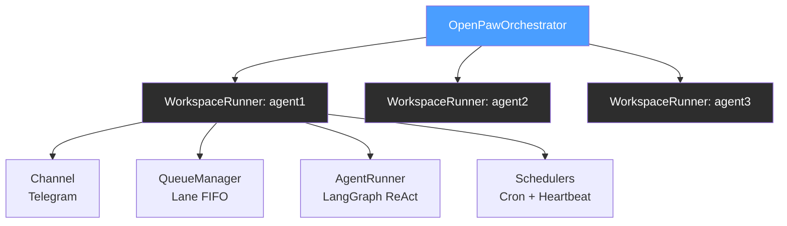
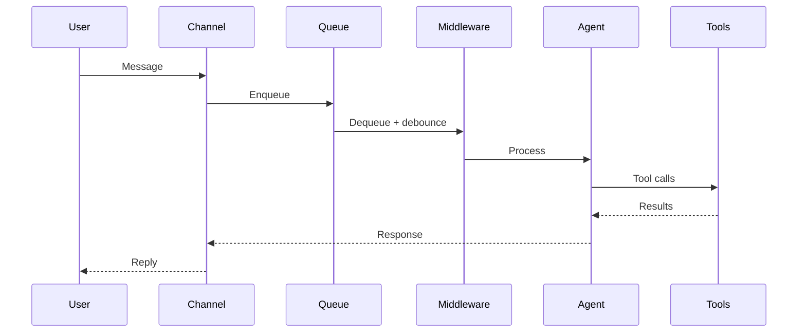

# OpenPaw

**A LangGraph-native framework for building autonomous AI personal assistants.**

> **Note:** This is a hobby project, mostly built for personal use. It was developed collaboratively with a Claude Code AI engineering team. Contributions and ideas welcome, but expect rough edges.

OpenPaw gives your AI agents real agency -- they can spawn sub-agents, browse the web, schedule their own follow-ups, process documents, manage persistent tasks, and ask for human approval before taking dangerous actions. Built on [LangGraph](https://langchain-ai.github.io/langgraph/) and [LangChain](https://www.langchain.com/), it plays natively with the `@tool` ecosystem you already know.

## What is OpenPaw?

Each agent runs in an isolated workspace with its own personality, communication channel, scheduled tasks, filesystem, and tool loadout. Run one assistant or a dozen -- they stay completely independent.



## Key Features

### Autonomy
- **Sub-agent spawning** — Agents spawn concurrent background workers for parallel tasks
- **Self-scheduling** — Agents create their own cron jobs that persist across restarts
- **Self-continuation** — Multi-step autonomous workflows via followup tool with depth limiting
- **Task tracking** — Persistent TASKS.yaml for long-running work across sessions

### Intelligence
- **Browser automation** — Playwright-based web interaction with accessibility tree navigation
- **Web search** — Brave Search API integration
- **Document processing** — Automatic PDF/DOCX/PPTX to markdown with OCR ([Docling](https://github.com/docling-project/docling))
- **Voice transcription** — Audio message transcription via [Whisper](https://openai.com/index/whisper/)

### Safety
- **Approval gates** — Human-in-the-loop authorization for dangerous operations
- **Sandboxed filesystem** — Path traversal protection, `.openpaw/` isolation
- **Domain security** — Per-workspace allowlists/blocklists for web browsing

### Operations
- **Conversation persistence** — Durable conversations that survive restarts (AsyncSqliteSaver)
- **Token tracking** — Per-invocation metrics with today/session aggregation
- **Slash commands** — `/new`, `/compact`, `/status`, `/queue`, `/help`
- **Timezone awareness** — Per-workspace IANA timezone for scheduling and display
- **Multi-model support** — Anthropic, OpenAI, AWS Bedrock, or any OpenAI-compatible API

## Message Flow



## Quick Start

### Prerequisites

- Python 3.11+
- [Poetry](https://python-poetry.org/) 2.0+
- A Telegram bot token ([create one via BotFather](https://core.telegram.org/bots#botfather))
- At least one model provider credential (Anthropic, OpenAI, or AWS Bedrock)

### Installation

```bash
# Clone the repository
git clone https://github.com/jsosoka/OpenPaw.git
cd OpenPaw

# Install core dependencies (includes Docling + Playwright)
poetry install

# Install Playwright browser
poetry run playwright install chromium

# Optional extras for additional builtins
poetry install -E voice          # Whisper transcription + ElevenLabs TTS
poetry install -E web            # Brave Search
poetry install -E system         # SSH remote execution
poetry install -E memory         # Semantic memory search (sqlite-vec)
poetry install -E all-builtins   # Everything above
```

### Configuration

1. Copy the example configuration:

```bash
cp config.example.yaml config.yaml
```

2. Set required environment variables:

```bash
# Channel
export TELEGRAM_BOT_TOKEN="your-telegram-token"

# Model provider (choose one or more)
export ANTHROPIC_API_KEY="your-key"
export OPENAI_API_KEY="your-openai-key"  # Also used by Whisper
# Or AWS Bedrock
export AWS_ACCESS_KEY_ID="your-access-key"
export AWS_SECRET_ACCESS_KEY="your-secret-key"
export AWS_REGION="us-east-1"

# Optional builtin API keys
export BRAVE_API_KEY="your-brave-key"
export ELEVENLABS_API_KEY="your-key"
```

3. Edit `config.yaml` with your preferences. See `config.example.yaml` for all options.

### Create Your First Workspace

Copy one of the example workspaces to get started:

```bash
# Minimal assistant workspace
cp -r example_agent_workspaces/assistant agent_workspaces/my-agent

# Advanced research assistant with custom tools
cp -r example_agent_workspaces/research_assistant_krieger agent_workspaces/my-researcher
```

Each workspace requires four markdown files that define the agent's identity:

| File | Purpose |
|------|---------|
| `AGENT.md` | Capabilities and behavior guidelines |
| `USER.md` | User context and preferences |
| `SOUL.md` | Core personality and values |
| `HEARTBEAT.md` | Scratchpad for proactive check-ins (can start empty) |

Optional workspace files include `agent.yaml` (per-workspace config), `.env` (secrets), `tools/` (custom LangChain tools), and `crons/` (scheduled tasks).

### Run

```bash
# Single workspace
poetry run openpaw -c config.yaml -w my-agent

# Multiple workspaces
poetry run openpaw -c config.yaml -w agent1,agent2

# All workspaces
poetry run openpaw -c config.yaml --all

# Verbose logging
poetry run openpaw -c config.yaml -w my-agent -v
```

## Example Workspaces

**`example_agent_workspaces/assistant/`** — Minimal workspace demonstrating the core personality system (AGENT.md, USER.md, SOUL.md, HEARTBEAT.md). Good starting point for building your own agent.

**`example_agent_workspaces/research_assistant_krieger/`** — Advanced workspace showcasing custom tools integration:
- GPT Researcher for web research reports
- PDF generation for report output
- Multi-model vision analysis
- Workspace-specific `.env` and tool dependencies

## Builtins

Tools and processors conditionally loaded based on available packages and API keys:

| Builtin | Type | Description |
|---------|------|-------------|
| `browser` | Tool | Web automation via Playwright with accessibility tree |
| `brave_search` | Tool | Web search via Brave API |
| `spawn` | Tool | Sub-agent spawning for concurrent background tasks |
| `cron` | Tool | Agent self-scheduling (one-time and recurring) |
| `task_tracker` | Tool | Persistent task management via TASKS.yaml |
| `send_message` | Tool | Mid-execution user messaging |
| `send_file` | Tool | Send workspace files to users |
| `followup` | Tool | Self-continuation for multi-step workflows |
| `memory_search` | Tool | Semantic search over past conversations |
| `shell` | Tool | Local shell command execution |
| `ssh` | Tool | Remote SSH execution |
| `elevenlabs` | Tool | Text-to-speech voice responses |
| `file_persistence` | Processor | Universal file upload handling with date partitions |
| `docling` | Processor | PDF/DOCX/PPTX to markdown with OCR |
| `whisper` | Processor | Audio/voice transcription |
| `timestamp` | Processor | Message timestamp injection |

See [Builtins Documentation](docs/builtins.md) for configuration details and adding custom builtins.

## Custom Tools

Drop any LangChain `@tool` into the `tools/` directory:

```python
# agent_workspaces/my-agent/tools/weather.py
from langchain_core.tools import tool

@tool
def get_weather(city: str) -> str:
    """Get current weather for a city."""
    # Your implementation here
    return fetch_weather(city)
```

Add tool-specific dependencies to `tools/requirements.txt` — they auto-install at startup. See [Workspaces Documentation](docs/workspaces.md) for details.

## Documentation

- [Getting Started](docs/getting-started.md) — Installation and first workspace setup
- [Configuration](docs/configuration.md) — Global and workspace configuration reference
- [Workspaces](docs/workspaces.md) — Workspace structure and personality files
- [Channels](docs/channels.md) — Channel system and Telegram setup
- [Queue System](docs/queue-system.md) — Queue modes, lanes, and concurrency
- [Cron Scheduler](docs/cron-scheduler.md) — Scheduled task configuration
- [Builtins](docs/builtins.md) — Available tools, processors, and adding custom ones
- [Architecture](docs/architecture.md) — System design and component interactions

## Development

```bash
# Run the full test suite (1,000+ tests)
poetry run pytest

# Lint
poetry run ruff check openpaw/
poetry run ruff check openpaw/ --fix

# Type check
poetry run mypy openpaw/
```

## License

[PolyForm Noncommercial 1.0.0](LICENSE)

## Credits

OpenPaw draws architectural inspiration from [OpenClaw](https://github.com/openclaw)'s command queue and channel patterns. Built on [LangGraph](https://langchain-ai.github.io/langgraph/) and [LangChain](https://www.langchain.com/). Developed with [Claude Code](https://claude.ai/code).
