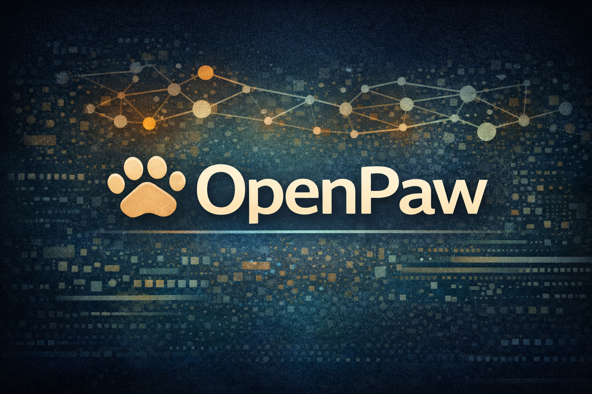

<div align="center">
  
  <p><strong>A Friendly <a href="https://langchain-ai.github.io/langgraph/">LangChain/LangGraph</a> Multi-Agent Runner</strong></p>
  <p>
    <a href="https://github.com/johnsosoka/OpenPaw/actions/workflows/ci.yml"></a>
    <a href="https://github.com/johnsosoka/OpenPaw/actions/workflows/docs.yml"></a>
    
    
  </p>
</div>

---

OpenPaw gives each agent its own workspace -- personality files, custom tools, scheduled tasks -- then gets out of the way. It handles the orchestration so you can focus on what your agents actually do.

Agents can ingest documents, browse the web, search the internet, and manage their own files -- making them well-suited for research, information processing, and long-running autonomous workflows. Give them a schedule and they'll check in on their own.

> **[Read the full documentation](https://johnsosoka.github.io/OpenPaw/)**

## Highlights

**First Class Document processing** -- Docling OCR/ICR turns scanned PDFs, DOCX, and PPTX into markdown automatically. Whisper transcribes voice messages on arrival.

**Drop-in custom tools** -- Write a `@tool` function, put it in `agent/tools/`, restart. Your agent picks it up with zero wiring.

**Multi-agent spawning** -- Agents spin up background workers for parallel tasks with full lifecycle tracking and result collection.

**Dynamic tool assignment** -- Spawned sub-agents can be given a tailored tool loadout via allow/deny lists, so each worker gets only the capabilities it needs.

**Cron scheduling and heartbeats** -- Recurring jobs, one-shot timers, proactive check-ins. Agents can even self-schedule follow-ups at runtime.

**Browser automation** -- Playwright-driven web interaction via accessibility tree. Agents reference page elements by number, not CSS selectors.

**Approval gates** -- Human-in-the-loop authorization for dangerous operations, with configurable timeouts and channel-native UI.

**Workspace isolation** -- Each agent gets its own SOUL.md personality, tools directory, conversation history, channel, and sandboxed filesystem.

**Multi-provider LLM support** -- Anthropic, OpenAI, AWS Bedrock, xAI, and any OpenAI-compatible endpoint. Switch models at runtime with `/model`.

**Memory and observability** -- Vector search for semantic recall, conversation archiving to markdown and JSON, and session logs for every cron, heartbeat, and sub-agent run. Full visibility into what your agents are doing and thinking.

## Quick Start

### 1. Install

```bash
git clone https://github.com/johnsosoka/OpenPaw.git
cd OpenPaw
poetry install
```

### 2. Scaffold a workspace

```bash
poetry run openpaw init my_agent \
  --model anthropic:claude-sonnet-4-20250514 \
  --channel telegram
```

### 3. Configure

```bash
cp config.example.yaml config.yaml
```

Add your API keys to `agent_workspaces/my_agent/config/.env`:

```bash
ANTHROPIC_API_KEY=your-key-here
TELEGRAM_BOT_TOKEN=your-token-here
```

### 4. Run

```bash
poetry run openpaw -c config.yaml -w my_agent
```

## CLI Commands

| Command | Description |
|---------|-------------|
| `openpaw init <name>` | Scaffold a new agent workspace |
| `openpaw init <name> --model <provider:model>` | Scaffold with a pre-configured model |
| `openpaw init <name> --channel telegram` | Scaffold with Telegram channel pre-configured |
| `openpaw list` | List available workspaces |
| `openpaw -c config.yaml -w <name>` | Run a single workspace |
| `openpaw -c config.yaml -w name1,name2` | Run multiple workspaces |
| `openpaw -c config.yaml --all` | Run all discovered workspaces |
| `openpaw -c config.yaml -w <name> -v` | Run with verbose logging |

All commands should be prefixed with `poetry run` when running from the project directory.

## Agent Workspace Structure

Each workspace lives under `agent_workspaces/<name>/` and is organized into five directories:

```
agent_workspaces/my_agent/
├── agent/              # Identity and extensions
│   ├── AGENT.md        # Capabilities and behavior guidelines
│   ├── USER.md         # User context and preferences
│   ├── SOUL.md         # Core personality and values
│   ├── HEARTBEAT.md    # Session state scratchpad (agent-writable)
│   ├── tools/          # Custom LangChain @tool functions
│   └── skills/         # Skill directories
├── config/             # Configuration (write-protected)
│   ├── agent.yaml      # Per-workspace settings (model, channel, queue)
│   ├── .env            # API keys and secrets
│   └── crons/          # Scheduled task definitions
├── data/               # Framework-managed state (write-protected)
│   ├── TASKS.yaml      # Persistent task tracking
│   ├── uploads/        # User-uploaded files
│   └── ...             # Conversations DB, session state, token logs
├── memory/             # Archived conversations and session logs
│   ├── conversations/  # Conversation exports (markdown + JSON)
│   └── logs/           # Heartbeat, cron, and sub-agent session logs
└── workspace/          # Agent work area (default write target)
    ├── downloads/      # Browser-downloaded files
    └── screenshots/    # Browser screenshots
```

The `openpaw init` command scaffolds this structure with starter templates. Customize the identity files in `agent/` to shape your agent's personality and purpose. Configure model, channel, and queue behavior in `config/agent.yaml`.

Existing workspaces using the older flat layout are automatically migrated on first startup. The `data/` and `config/` directories are write-protected from agent filesystem tools. Write operations default to the `workspace/` directory unless an explicit path is provided.

## In-Chat Commands

Once running, agents respond to framework commands in Telegram:

| Command | Description |
|---------|-------------|
| `/help` | List available commands |
| `/status` | Show model, context usage, tasks, and token usage |
| `/new` | Archive conversation and start fresh |
| `/compact` | Summarize, archive, and continue with summary |
| `/model <provider:model>` | Switch LLM model at runtime |

## Documentation

- [Getting Started](docs/getting-started.md) -- Installation, first workspace, and troubleshooting
- [Configuration](docs/configuration.md) -- Global and per-workspace configuration reference
- [Workspaces](docs/workspaces.md) -- Workspace structure, custom tools, and cron jobs
- [Architecture](docs/architecture.md) -- System design and component interactions
- [Channels](docs/channels.md) -- Channel system and access control
- [Queue System](docs/queue-system.md) -- Queue modes and message handling
- [Cron Scheduler](docs/cron-scheduler.md) -- Scheduled tasks and heartbeat system
- [Built-ins](docs/builtins.md) -- Web search, browser automation, voice, sub-agents, and more

## Contributing

Development follows a GitFlow branching model:

- **`main`** -- Stable releases only. Protected branch, requires CI to pass.
- **`develop`** -- Integration branch. Feature and bugfix PRs target `develop`.
- **Feature branches** -- Branch from `develop` as `feature/`, `bugfix/`, `docs/`, or `chore/`.

See [CONTRIBUTING.md](CONTRIBUTING.md) for the full development guide.

## Prerequisites

- Python 3.11+
- [Poetry 2.0+](https://python-poetry.org/docs/#installation)
- A Telegram bot token ([via BotFather](https://core.telegram.org/bots#botfather))
- At least one model provider API key (Anthropic, OpenAI, or AWS credentials for Bedrock)

## License

[PolyForm Noncommercial 1.0.0](LICENSE)
