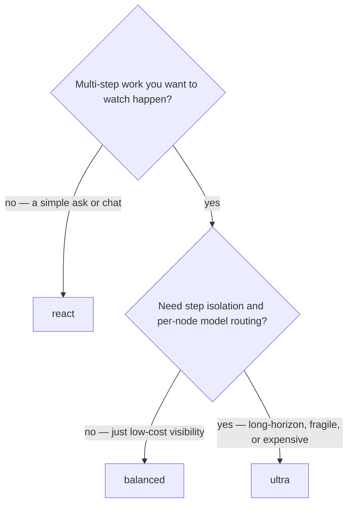
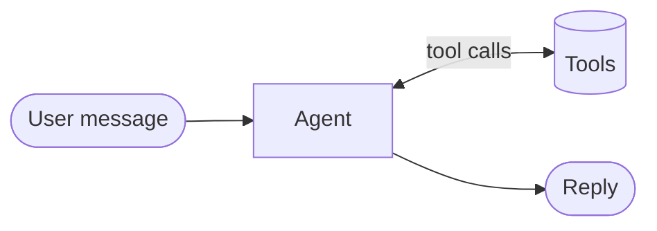
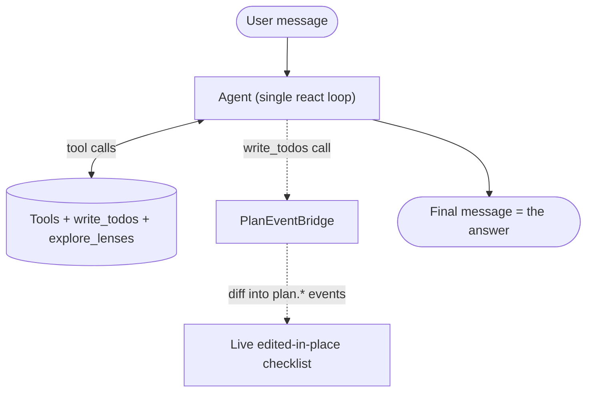
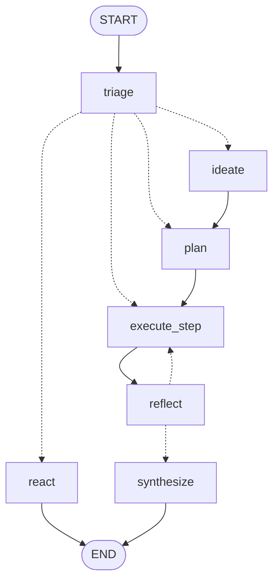
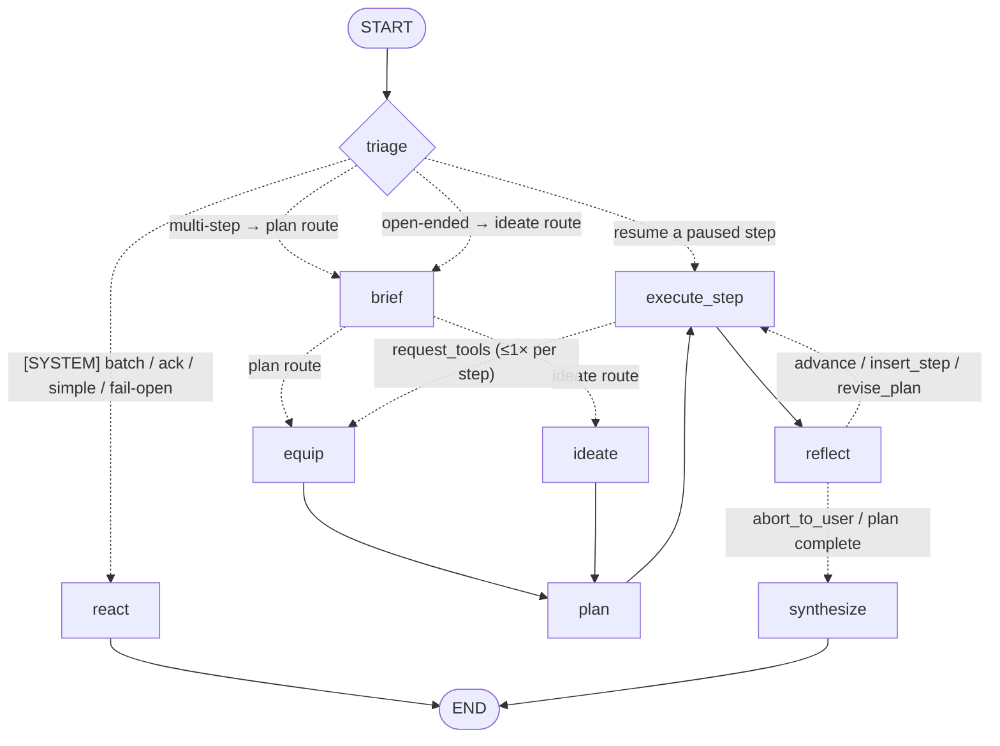
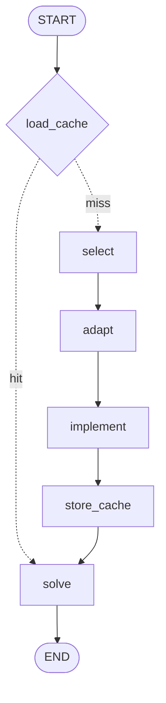
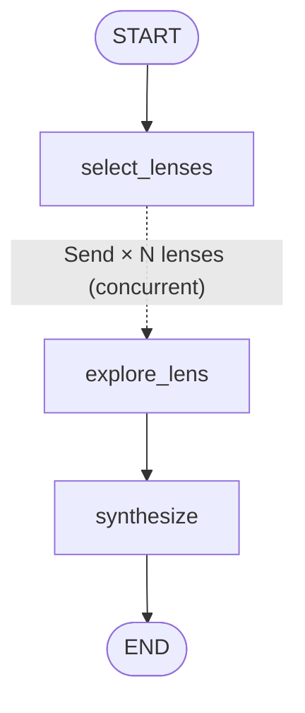
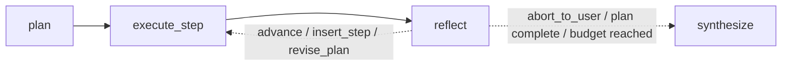

# Agent Harnesses

OpenPaw ships three interchangeable agent **harnesses**, selected per workspace by `harness.type` (`react` | `balanced` | `ultra`). They all program against one `AgentHarness` seam (`openpaw/agent/harness/base.py`), so `MessageProcessor`, `WorkspaceRunner`, and the slash commands are topology-agnostic — every `create_agent` internal lives behind the seam. The `react` loop is the untouched default; `balanced` and `ultra` add plan visibility and (for `ultra`) planning, reflection, and per-node model routing on top of it.

---

## The three tiers

| | `react` | `balanced` | `ultra` |
|---|---|---|---|
| **Topology** | bare `create_agent` loop | one loop + plan middleware | LangGraph `StateGraph` around the loop |
| **Plan visibility** | none | live todo-driven checklist | live graph-driven checklist |
| **Per-turn harness LLM overhead** | 0 | 0 (plan rides inside work turns) | triage + brief + plan + reflect×steps + synthesize (≈4–8+) |
| **Step context** | one shared | one shared | **fresh, unpersisted per step** (isolation) |
| **Per-node models** | no | no | yes (each node points at a catalog model) |
| **Creative strategy** | none | `explore_lenses` tool (zero LLM) | `ideonomy` reasoning module |
| **Reflection** | none | organic + optional checkpoint | `light` / `full` modules, or `off` |
| **Best for** | chat, simple turns | everyday multi-step work you want to watch, at react cost | long-horizon work needing step isolation + model routing |

The insight behind the middle tier: the three features that make `ultra` expensive — triage branching, per-node models, and step-scoped context isolation — are exactly the features `balanced` omits, so their absence *is* the point. `balanced` was ADR-101's own "middleware-only harness" fallback, promoted to a peer.

All three tiers inherit the same middleware stack (approval gates, steer/interrupt, tool timeouts, status updates) and the same learning loop (skills, `manage_skill`, the Phase-2 evaluator) — those are workspace-level, orthogonal to `harness.type`. In `ultra`, they apply to every planned step *by construction* because each step re-invokes the same compiled react loop.

---

## Choosing a harness



- **`react`** — a direct answer or a couple of tool calls. No plan, no overhead. Workspaces that never set `harness:` behave exactly as before 0.5.0.
- **`balanced`** — everyday multi-step tasks where the user should see a live checklist, but the work does not justify per-step LLM planning. Zero extra harness LLM calls: the plan is just the agent's own todo list.
- **`ultra`** — long-horizon or fragile work that benefits from an explicit plan, per-step context isolation, reflection between steps, and routing cheap nodes (triage, selector) to a fast model while planning runs on a strong one.

---

## React harness

The baseline: the compiled `create_agent` ReAct loop, wrapped unchanged.



There is nothing harness-specific to configure. Everything below is about the two tiers layered on top of it.

---

## Balanced harness

`BalancedHarness` (`openpaw/agent/harness/balanced.py`) *is* the react loop — it subclasses `AgentRunner` and adds a small middleware stack at build time. No new graph, one shared context, zero harness LLM calls.



**How the checklist works (zero extra LLM calls).** A thin custom `TodoListMiddleware` (`openpaw/agent/middleware/todo_list.py`) contributes a `write_todos` tool whose list lives in agent state and checkpoints per thread. `PlanEventBridge` (`plan_event_bridge.py`) wraps that tool, diffs each new list against the previous one, and emits the *same* `plan.*` status events the `ultra` checklist renderer already consumes:

- first non-empty list → `plan.created`
- an item flips to `in_progress` → `plan.step_started`
- flips to `completed` → `plan.step_completed`
- any content/order change beyond status → an authoritative `plan.revised`

Because the todo list has no stable step IDs, IDs are synthesized positionally and diffing is by content — spurious revisions are tolerated, spurious completions are not. Every update rides inside a turn the model was already taking, so the live checklist costs nothing extra.

**Statuses.** The custom todo tool forks the stock middleware to add two things John required: a first-class `failed` status (renders ✗) and an optional one-line `note` (why / what next), surfaced as a progress line without any extra call. Full status set: `pending` / `in_progress` / `completed` / `failed`.

**Survives compaction.** Auto-compact rotates to a fresh thread and strips the tool-message echoes the model relies on to remember its plan. `render_todo_reminder()` re-injects the current todos as a system reminder after compaction so the checklist survives conversation rotation.

**Reflection.** Organic by default: in one shared context the model sees every tool failure and its own checklist, so self-correction happens on the next turn and a todo rewrite *is* the replan. `harness.reflection.mode: checkpoint` escalates to one structured verdict call every N completed steps (immediately on a failed one), reusing `LightReflection`'s schema; the verdict is appended to the `write_todos` tool result as a course-correction nudge.

**Creative asks.** The `explore_lenses` tool (`harness.ideation`) runs ideonomy's deterministic lens selector and hands the model the selected themes and question lenses as tool output — the agent thinks them through in the same turn. **Zero LLM passes** in selection; contrast the full `ideonomy` module below, which spends one LLM call per lens. The full parallel module remains `ultra`-exclusive.

**Subagents** run as plain react regardless of the parent harness.

See `llm_memory/balanced-harness/DESIGN.md` for the full rationale and the reference-harness research (DeepAgents, OpenClaw, Hermes, Claude Code, Manus) that converged on this single-loop + in-context-todo shape.

---

## Ultra harness

`ultra` is a thin custom `StateGraph` (`openpaw/agent/harness/ultra/graph.py`) that owns *deliberation*; the embedded `create_agent` loop owns *action*. The `react` node is the existing compiled loop embedded directly (shared `messages` key — byte-for-byte identical behavior); each `execute_step` invokes that same compiled graph with a fresh, step-scoped message list and checkpointing disabled, so every step runs in isolated, unpersisted context while still inheriting all middleware.

### Core topology



### Full flow (with the conditionally-added nodes)

The `brief` and `equip` nodes are only added to the graph when enabled, and they route via `Command(goto=...)` rather than static edges — so a compiled-graph render can't show their wiring. The complete flow, with both features on:



> When `brief` is disabled, `triage` routes straight to `equip`/`ideate`/`plan`. When equipping is disabled, the `equip` node is absent and `brief`/`ideate` route straight to `plan`. When `reflection.module: off`, the `reflect` node is absent and `execute_step` loops directly on plan state. The diagram shows the fully-featured path.

**Node by node:**

- **`triage`** — classifies each batch and routes, with deterministic short-circuits *before* the LLM call (see below). Fails open to `react` on any error — the harness is never less reliable than the plain loop.
- **`brief`** (ADR-108, `harness.brief`, **on by default**) — on the plan/ideate paths only, one structured-output call reads the **full session history** — token-budgeted against the brief model's actual context window, not a fixed cutoff — and distills a `ContextBrief` (situation, constraints, prior attempts, preferences). It flows to planning/creative/reflection modules, step execution, and synthesis. React traffic never pays for it; a brief failure falls open to a role-labeled, dialogue-only digest.
- **`equip`** (ADR-104, `harness.tool_equipping`, off by default) — one structured call selects a tool subset for the task before planning, or re-equips mid-plan when a step calls `request_tools` (max once per step). Fails open to the full toolset.
- **`ideate`** — runs the configured creative module (see [Creative strategies](#creative-strategies)); its `IdeationResult` feeds the planner.
- **`plan`** — synthesizes the `Plan` via the configured planning module, with a `direct` → synthetic-single-step fallback chain so it never dead-ends.
- **`execute_step`** — runs the react loop scoped to the current `PlanStep` (objective + checklist + brief injected), unpersisted. Approval/interrupt errors propagate out exactly as in the plain loop; `UltraHarness` owns the resume/clear contracts.
- **`reflect`** — evaluates the step outcome via a reflection module and updates plan state (see [Reflection strategies](#reflection-strategies)).
- **`synthesize`** — composes the final user-facing response from the plan and step results; falls back to raw step results if the call fails.

Plans are first-class checkpointed state, so a restart resumes mid-plan for free; `/compact` and `/new` drop plan state with the conversation, which is correct by definition.

### Triage short-circuits

Triage is fed the wrong thing if it classifies the whole conversation digest — a compliment after a large project can be misread as "continue the multi-step work" and re-run the entire thing (this actually happened; see `llm_memory/triage-shortcircuit/DESIGN.md`). The current code guards this in three layers (`graph.py`):

1. **`[SYSTEM]` batches → `react`.** A batch whose latest message starts with `[SYSTEM]` (sub-agent completion, cron/heartbeat injection) short-circuits to `react` before any LLM call — belt-and-braces to the same detection in `MessageProcessor`.
2. **Terminal acknowledgments → `react`.** `_is_terminal_acknowledgment()` is a conservative, deterministic matcher: it normalizes the latest message, drops filler words, and routes to `react` only if every remaining token is an acknowledgment word (`thanks`, `great`, `ok`, …) and the message is short. Any content word ("do", "summarize", "fix") blocks the match, so it fails *toward* the LLM — a missed ack is harmless. It is a cost/latency optimization and safety net, not the correctness fix.
3. **LLM classify — latest message weighted.** The remaining case sends the recent conversation as *reference-only context* plus the latest message set apart as the thing to classify (`TRIAGE_INPUT_TEMPLATE`, `prompts.py`). The prompt instructs the model to classify only the latest message and to treat a post-task acknowledgment as `react` even when the prior task was large.

A `resume_step_id` on the thread (approval-resume) is handled first: triage jumps straight back to the paused `execute_step`.

Blast radius is bounded by `harness.execution.timeout_seconds` and `harness.execution.max_steps`. Note: the timeout path clears plan state (matching the interrupt path) so a timed-out run leaves no live-looking plan debris.

---

## Planning strategies

The planning, creative, and reflection nodes are pluggable behind one `ReasoningModule` ABC (ADR-102): `name`, `kind` (`PLANNING` | `CREATIVE` | `REFLECTION`), a one-line `tagline`, a `build(workspace)` factory, and an async `run(ctx) -> ReasoningArtifact`. Modules never call each other — the graph owns composition — so each is independently testable and substitutable. Adding one is a single class plus a `MODULE_REGISTRY` entry (`modules/registry.py`).

Selection is per-kind (`modules/selector.py`), resolved at graph-build time:

- **Pinned name** → bind directly, no selector node, zero cost.
- **`auto` with one candidate** → short-circuit bind, no LLM call (`reason: "only candidate"`).
- **`auto` with ≥2 candidates** → one structured-output call over the candidates' taglines picks the best fit; any failure falls open to the kind default (`direct` / `ideonomy` / `light`).

Every path emits `module.selected`, so "which module planned this?" is answerable from the session log.

### Shipped planning modules

| Module | Kind | Tagline |
|---|---|---|
| `direct` | PLANNING | Fast single-call plan synthesis; reliable baseline (and the fallback when richer modules fail) |
| `self_discover` | PLANNING | Composes a task-specific reasoning structure before planning; best for novel, hard, multi-step tasks |

### self_discover (deep dive)

A faithful adaptation of Self-Discover (Zhou et al. 2024), implemented as a compiled LangGraph subgraph behind the unchanged `run()` contract (ADR-109). Two stages: **discovery** (SELECT → ADAPT → IMPLEMENT over 39 seed reasoning modules, three structured-output calls) produces a reusable reasoning *structure*; **solve** (one call) follows the structure to synthesize a `Plan`.



- **SELECT** returns *indices* into the numbered seed-module list (maximally parse-reliable); out-of-range picks are dropped, an empty selection falls back to a core default set.
- **ADAPT** rephrases the selected modules for the task; **IMPLEMENT** returns an ordered `{name, instruction}` step list (structured output replaces the old freeform-JSON parse). The result is cached as an insertion-ordered `{name: instruction}` dict — the cache entry shape is unchanged, so old cached structures stay valid.
- **Per-task-type cache** (`modules/self_discover/cache.py`, workspace-local) keyed by a task-type signature: a **hit skips discovery entirely** and goes straight to solve (1 call instead of 4). Discovery prompts are deliberately task-only — no tools, no digest — so cached structures transfer across toolsets and models (the paper's transferability finding; per-node models let discovery run on a stronger model than solve).

**When it's worth it:** novel, hard, multi-step tasks where a bespoke reasoning structure pays for the three discovery calls — amortized to near-zero on repeat task types. The subgraph runs unpersisted; its stages appear as namespaced nodes in the outer stream and emit `module.phase` / `module.insight` (cache-hit vs discover, each stage, a structure snapshot).

---

## Creative strategies

| Module | Kind | Tagline |
|---|---|---|
| `ideonomy` | CREATIVE | Divergent ideation through ideonomic lenses; strongest for open-ended or creative tasks |

### ideonomy (deep dive)

Ideonomy is Patrick Gunkel's "science of ideas" (<https://ideonomy.mit.edu>); the division data and selection mechanics are ported with attribution from the MIT-licensed [Morpheis/ideonomy-engine](https://github.com/Morpheis/ideonomy-engine). Lens *selection* is deterministic and costs no tokens — it keyword-scores the task against curated ideonomic divisions and emits lenses (a core question plus guiding questions). The module then spends one LLM call per selected lens and one synthesis call.



`select_lenses` is zero-token; `_fan_out` emits one LangGraph `Send` per lens, so the **lens explorations run concurrently** (wall-clock ≈ two sequential calls regardless of lens count). A failed lens contributes nothing (an `operator.add` reducer tolerates it); `synthesize` raises only if *every* lens failed. The final `IdeationResult` (ideas, evaluations, recommended directions) feeds the planner on the ideate path.

**Contrast with balanced's `explore_lenses` tool:** same deterministic selector, but the balanced tool returns the lenses as tool output for the agent to think through in-context — **zero LLM passes**, no fan-out, no discrete artifact. The full parallel subgraph is `ultra`-exclusive.

---

## Reflection strategies

Reflection is a module kind, not a hardcoded node — `harness.reflection.module` selects the behavior (`ultra`):

| Module | Kind | Behavior |
|---|---|---|
| `light` (default) | REFLECTION | One structured verdict per step; never rewrites the plan (`revise_plan` is coerced to `advance`, notes preserved) |
| `full` | REFLECTION | Verdict as in light; on `revise_plan`, a second call rewrites only the remaining steps |
| `off` | — | Omits the `reflect` node entirely — `execute_step` marks the step done and advances directly |

Each verdict picks one action: **`advance`** (next step), **`insert_step`** (add one corrective step), **`revise_plan`** (rewrite the remaining tail — `full` only), or **`abort_to_user`** (stop and surface to the user). `light` is the cheap default; `full` is for long or fragile plans where the tail may need rewriting mid-flight.



The loop continues while pending steps remain, within `execution.max_steps`, and no abort is set. A reflection failure fails open to `advance` — a broken reflector must not stall the plan.

---

## Observability

Every observable happening — runs, tools, sub-agents, node transitions, plan lifecycle, module selection/phases, reflection verdicts, skill and learning events — is a machine-readable `StatusEvent` (ADR-106, `model/status_event.py`) fanned through a per-workspace `StatusBus` to pluggable sinks: the channel renderer (the live edited-in-place checklist) and a JSONL event log, with a web portal as a future consumer. Emission is best-effort and never blocks or fails a run.

`balanced` and `ultra` share the same event vocabulary — that is exactly why `balanced`'s `PlanEventBridge` can emit `plan.*` events that the `ultra` checklist renderer draws unchanged. Inside the `ultra` graph, reasoning-module stages emit over LangGraph's custom stream; `UltraHarness` forwards them to the bus and stamps run identity centrally. Harness nodes also emit `node.completed` with token counts and latency, landing per-node rows in `token_usage.jsonl`.

---

## Config quick reference

Field names and defaults from `openpaw/core/config/models/harness.py`. New 0.5.0 groups use `extra="forbid"` — typos fail fast. A bare `harness: {type: ultra}` validates and runs with every node inheriting the workspace model.

```yaml
harness:
  type: react                     # react | balanced | ultra   (default: react)

  # --- balanced-only groups (ignored by react/ultra) ---
  plan:
    visibility: true              # PlanEventBridge -> live checklist
  ideation:
    lens_tool: true               # register the zero-LLM explore_lenses tool
    lens_count: 3                 # lenses per call (1–7)

  # --- ultra node model pointers (catalog name or "provider:model"); unset = inherit ---
  triage:   {model: null}
  planning: {module: direct, model: null, allowed: null}   # direct | self_discover | auto
  creative: {module: ideonomy, model: null, allowed: null} # ideonomy | auto
  reflection:
    module: light                 # off | light | full | auto     (ultra)
    mode: organic                 # organic | checkpoint           (balanced)
    every: 3                      # checkpoint mode: verdict every N steps
    model: null
  selector:  {model: null}        # module: auto selection call
  synthesize: {model: null}

  # --- context brief (ultra, ADR-108) ---
  brief:
    enabled: true                 # on by default for ultra; react routes skip it
    max_input_tokens: null        # optional transcript cap; null = model window - headroom
    model: null

  # --- optional tool equipping (ultra, ADR-104) ---
  tool_equipping:
    enabled: false
    always_equip: [group:filesystem, send_message]
    max_tools: 25
    react_selector: false         # stock LLMToolSelectorMiddleware on the react path
    model: null

  # --- execution budgets (balanced + ultra) ---
  execution:
    max_steps: 12                 # ultra plan-step budget (1–100)
    max_turns: null               # inner-runner turn cap; null = workspace model.max_turns
    timeout_seconds: null         # wall-clock budget; null = workspace timeout
```

See [Configuration](configuration.md) for the full `harness:` reference and [Architecture](architecture.md#agent-harness) for how the harness seam fits the rest of the system.
