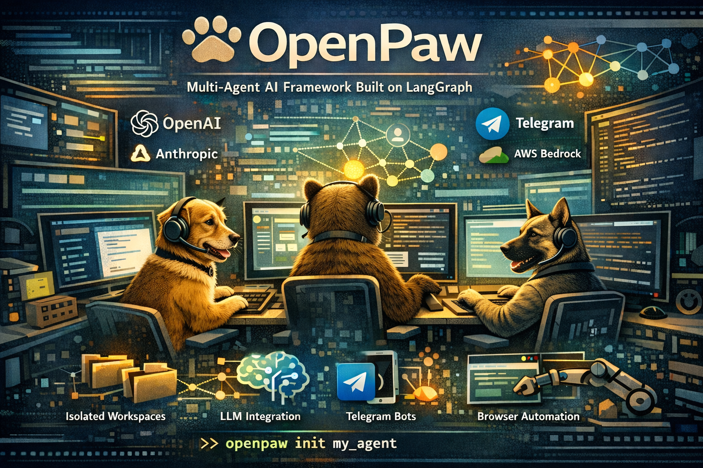

<div align="center">
  
</div>

# OpenPaw

**Multi-Channel AI Agent Framework built on LangGraph**

OpenPaw gives each AI agent its own isolated workspace — complete with memory, tools, scheduled tasks, and channel integrations — so you can run multiple agents from a single deployment.

---

## Key Features

- **Workspace Isolation** — Each agent gets its own filesystem, conversation history, configuration, and scheduled tasks. No cross-contamination.
- **Multi-Provider LLM Support** — Anthropic, OpenAI, AWS Bedrock, xAI, and any OpenAI-compatible API. Switch models at runtime with `/model`.
- **Channel Adapters** — Telegram today, with a factory pattern ready for new providers.
- **Built-in Tools** — Web search, browser automation, file operations, sub-agent spawning, task tracking, and self-scheduling — all sandboxed.
- **Inbound Processors** — Automatic file persistence, Whisper transcription, and Docling document conversion on incoming messages.
- **Cron & Heartbeat Scheduling** — Periodic tasks and proactive check-ins with configurable active hours.
- **Queue-Aware Middleware** — Collect, steer, or interrupt agent runs when users send follow-up messages.
- **Approval Gates** — Human-in-the-loop authorization for sensitive tool calls.
- **Conversation Persistence** — Durable checkpointing via SQLite, with auto-compact when context fills up.

---

## Quick Start

```bash
# Install
git clone https://github.com/johnsosoka/OpenPaw.git
cd OpenPaw
poetry install

# Scaffold a workspace
poetry run openpaw init my_agent --model anthropic:claude-sonnet-4-20250514 --channel telegram

# Run it
poetry run openpaw -c config.yaml -w my_agent
```

See the [Getting Started](getting-started.md) guide for full setup instructions.

---

## Learn More

- [Architecture](architecture.md) — How the system is structured
- [Configuration](configuration.md) — Global and per-workspace settings
- [Workspaces](workspaces.md) — Agent workspace layout and conventions
- [Channels](channels.md) — Channel adapters and adding new providers
- [Queue System](queue-system.md) — Message queueing and queue modes
- [Cron Scheduler](cron-scheduler.md) — Scheduled tasks and heartbeats
- [Built-ins](builtins.md) — Optional tools and processors
