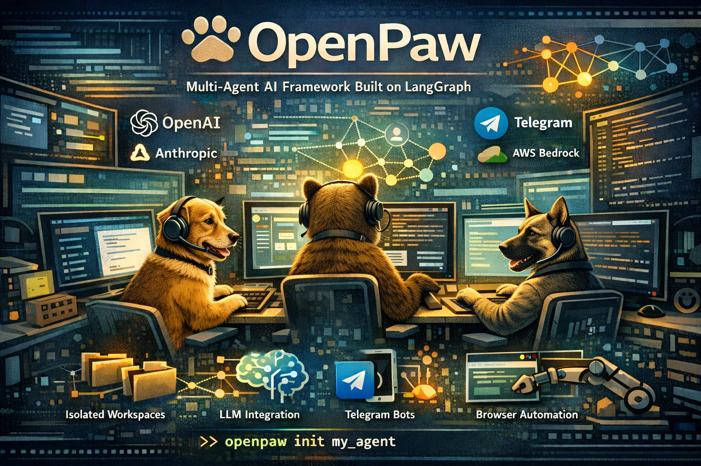
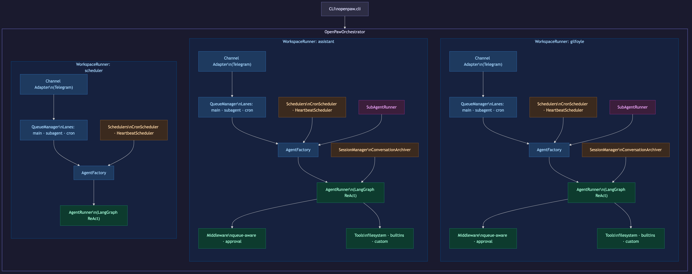

<div align="center">
  
</div>

# OpenPaw

**Multi-Channel AI Agent Framework built on LangGraph**

OpenPaw gives each AI agent its own isolated workspace — complete with memory, tools, scheduled tasks, and channel integrations — so you can run multiple agents from a single deployment.

---

## Why OpenPaw?

Most AI agent frameworks give you one agent in one context. OpenPaw takes a different approach: **each agent is a fully isolated workspace** with its own identity, tools, conversation history, and scheduled tasks. You define an agent's personality in markdown, configure its model and channel in YAML, drop in custom tools as Python files, and run everything from a single process.

This means you can run a personal assistant, a code reviewer, and a monitoring bot side by side — each with its own Telegram or Discord channel (or both), its own filesystem sandbox, and its own scheduled heartbeats — without them interfering with each other.

---

## Key Features

### Workspace Isolation

Each agent gets its own filesystem, conversation history, configuration, and scheduled tasks. Workspaces are defined by four markdown files (AGENT.md, USER.md, SOUL.md, HEARTBEAT.md) that shape the agent's personality and context.

### Multi-Provider LLM Support

Run agents on Anthropic Claude, OpenAI GPT, AWS Bedrock (Kimi K2, Nova, Mistral), xAI Grok, or any OpenAI-compatible API. Define provider connections once in a central catalog, then reference them by name. Switch models at runtime with `/model` — no restart required.

### Responsive Queue System

Four queue modes handle the reality that users send follow-up messages while agents are working. **Collect** queues messages for sequential processing. **Steer** redirects the agent mid-run when you change direction. **Interrupt** aborts the current run entirely. **Followup** lets agents chain their own continuations.

### Built-in Tools & Processors

Agents ship with web search, browser automation, sandboxed file operations, sub-agent spawning, task tracking, and self-scheduling. Incoming messages are automatically processed — files are saved, voice messages transcribed, and documents converted to markdown.

### Scheduling & Heartbeats

Define cron jobs for periodic tasks, or enable heartbeats for proactive agent check-ins. Agents can even schedule their own follow-up actions at runtime. Heartbeats support active hours, task-aware prompts, and a "nothing to report" protocol that prevents noise.

### Approval Gates

Require human authorization before sensitive tools execute. The agent pauses, the user sees approve/deny buttons in their chat, and the agent resumes or gracefully handles the denial.

### Conversation Persistence

Conversations survive restarts via durable checkpointing. When context fills up, auto-compact summarizes the conversation and starts fresh — no manual intervention needed. Full conversation archives are saved for long-term reference.

---

## Quick Start

```bash
# Install
git clone https://github.com/johnsosoka/OpenPaw.git
cd OpenPaw
poetry install

# Scaffold a workspace
poetry run openpaw init my_agent --model anthropic:claude-sonnet-4-20250514 --channel telegram

# Run it
poetry run openpaw -c config.yaml -w my_agent
```

**Requires Python 3.11+ and Poetry 2.0+.** See the [Getting Started](getting-started.md) guide for full setup including prerequisites, environment variables, and channel configuration.

---

## How It Works

[](assets/diagrams/system-overview.png)

OpenPaw runs an orchestrator that manages multiple workspace runners. Each workspace is fully isolated — its own channel adapter, message queue, agent instance, and scheduled tasks. Messages flow from the channel through inbound processors, into the queue, and out to the LangGraph agent. Responses route back through the channel to the user.

For a deeper understanding, start with [Concepts](concepts.md) for the mental model, then explore specific topics below.

---

## Documentation

| Page | What You'll Learn |
|------|-------------------|
| [Getting Started](getting-started.md) | Install, scaffold a workspace, and run your first agent |
| [Concepts](concepts.md) | How workspaces, scheduling, queues, and tools fit together |
| [Configuration](configuration.md) | Global and per-workspace settings reference |
| [Workspaces](workspaces.md) | Workspace structure, identity files, and custom tools |
| [Scheduling](scheduling.md) | Cron jobs, heartbeats, and dynamic scheduling |
| [Built-ins](builtins.md) | Optional tools (search, browser, spawn) and processors (Whisper, Docling) |
| [Channels](channels.md) | Channel adapters, access control, and adding new providers |
| [Queue System](queue-system.md) | Message queueing and the four queue modes |
| [Architecture](architecture.md) | System design, data flows, and architectural decisions |
