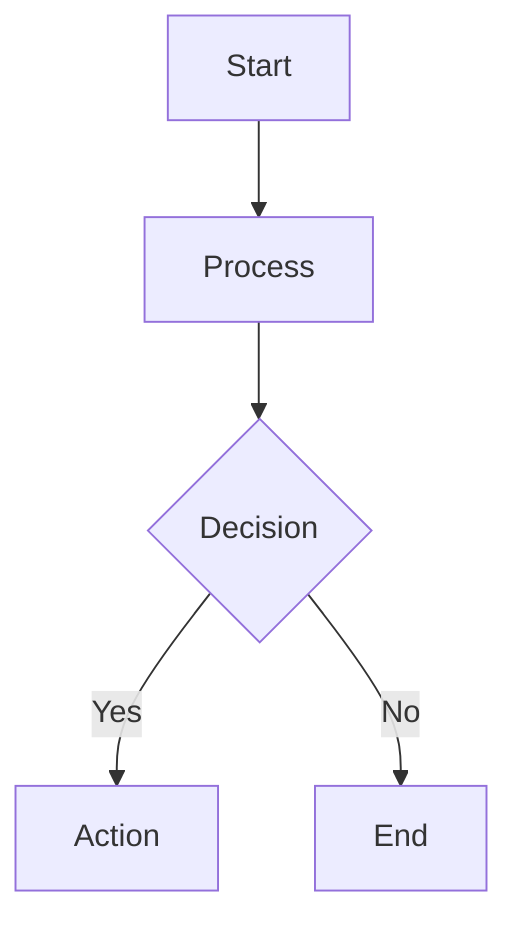

# Research Assistant (Krieger) — Advanced Example Workspace

An advanced OpenPaw workspace demonstrating custom tool integration with GPT Researcher, PDF generation, Mermaid diagram rendering, and multi-model image analysis. Based on a production research agent personality inspired by Archer's Dr. Krieger.

## Overview

This workspace showcases the full extensibility of OpenPaw by implementing a research-focused AI agent with a distinctive personality and powerful custom tools. It demonstrates how to create a specialized workspace that goes far beyond basic chat to provide autonomous research, document generation, and visual analysis capabilities.

## What Makes This Interesting

### GPT Researcher Integration
Autonomous multi-source web research that generates comprehensive reports with citations. Goes far beyond simple web search by:
- Generating sub-questions to cover a topic thoroughly
- Searching the web via Tavily or DuckDuckGo for each sub-question
- Reading and analyzing top results from each search
- Synthesizing findings into a structured markdown report with citations

### Custom Tool Ecosystem
Four custom tools showcasing the `@tool` decorator pattern:
- **deep_research** - Autonomous multi-source research with citation tracking
- **markdown_to_pdf** - Browser-quality PDF rendering with Mermaid diagram support
- **render_mermaid** - Diagram generation via mermaid.ink/kroki.io APIs
- **describe_image** / **compare_image_models** - Multi-model vision analysis

### Multi-Model Vision Analysis
Compare image analysis across Anthropic Claude, OpenAI GPT, and AWS Bedrock Nova in a single tool call. Useful for getting diverse perspectives or cross-referencing observations.

### Character-Driven Personality
Demonstrates the SOUL.md personality system with a distinctive mad-scientist voice. Shows how personality can enhance user engagement while maintaining professional output quality.

### Steer Queue Mode
Configured with responsive message handling for long-running research tasks. Users can redirect the agent mid-research if needed.

## Prerequisites

### Required
- All standard OpenPaw prerequisites (Python 3.12+, Poetry, OpenPaw dependencies)
- GPT Researcher: `pip install gpt-researcher>=0.14.6` (auto-installed from tools/requirements.txt)
- At least one LLM provider API key (Anthropic, OpenAI, or AWS Bedrock)
- Tavily API key for web search (or DuckDuckGo fallback)

### Optional
- md2pdf rendering service for PDF output (requires Node.js service)
- Multiple model provider API keys for vision comparison feature
- AWS credentials for Bedrock Nova vision model

## Setup

### 1. Copy to Your Workspaces

```bash
cp -r example_agent_workspaces/research_assistant_krieger agent_workspaces/my-researcher
```

### 2. Configure Environment Variables

Create your `.env` from the example:

```bash
cp agent_workspaces/my-researcher/.env.example agent_workspaces/my-researcher/.env
```

Edit `.env` with your actual API keys:

```bash
# Required: LLM for GPT Researcher's internal operations
ANTHROPIC_API_KEY=sk-ant-your-real-key-here
OPENAI_API_KEY=sk-proj-your-real-key-here

# Required: Web search provider
TAVILY_API_KEY=tvly-your-real-key-here

# Optional: Alternative model provider
# MOONSHOT_API_KEY=sk-your-moonshot-key-here

# Optional: PDF rendering service
# MD2PDF_SERVICE_URL=http://localhost:3000
```

**Important:** The GPT Researcher LLM configuration in `.env` (SMART_LLM, FAST_LLM, etc.) controls which models GPT Researcher uses internally for its research process. These are independent from your agent's main model configured in `agent.yaml`. Using lighter models like Claude Haiku keeps research costs low ($0.01-0.10 per run).

### 3. Update Workspace Configuration

Edit `agent_workspaces/my-researcher/agent.yaml`:

```yaml
channel:
  type: telegram
  token: ${TELEGRAM_BOT_TOKEN}  # Your bot token
  allowed_users:
    - 123456789  # Replace with YOUR Telegram user ID

heartbeat:
  enabled: true
  interval_minutes: 30
  active_hours: "08:00-22:00"
  suppress_ok: true
  output:
    channel: telegram
    chat_id: 123456789  # Replace with YOUR Telegram chat ID
```

To find your Telegram user ID, message [@userinfobot](https://t.me/userinfobot) on Telegram.

### 4. Run the Workspace

```bash
poetry run openpaw -c config.yaml -w my-researcher
```

## Custom Tools Reference

### Research Tools

#### `deep_research(query, report_type="research_report")`

Conduct autonomous web research using GPT Researcher.

**Parameters:**
- `query` (str): Research question or topic to investigate
- `report_type` (str): Type of report to generate
  - `"research_report"` (default) - Comprehensive analysis with citations (~1000-2000 words)
  - `"deep"` - Extended deep-dive with more sources (~2000-4000 words)
  - `"resource_report"` - Curated list of resources with summaries
  - `"outline_report"` - Structured outline format

**Returns:** JSON with word count, source count, and report path

**Example:**
```
User: "Research the current state of AI agent frameworks in 2026"
Agent: [Uses deep_research with refined query, saves report to reports/]
```

**Notes:**
- Research takes 3-10 minutes depending on query complexity
- Reports are saved to `reports/` with YAML frontmatter metadata
- Quality depends heavily on query specificity
- Costs $0.01-0.10 per research run (with Claude Haiku configuration)

#### `list_reports()`

List all saved research reports in the workspace.

**Returns:** JSON with list of reports including filename, size, and path

### Document Generation Tools

#### `markdown_to_pdf(markdown_path, output_filename="")`

Convert a markdown file to a styled PDF with rendered Mermaid diagrams.

**Parameters:**
- `markdown_path` (str): Path to markdown file (workspace-relative)
- `output_filename` (str): Optional output PDF filename (defaults to input name with .pdf extension)

**Returns:** JSON with status and output path

**Prerequisites:**
- Requires md2pdf rendering service running (see "PDF Rendering Service" section)
- Service URL defaults to `http://localhost:3000` (configurable via `MD2PDF_SERVICE_URL`)

**Features:**
- Browser-quality rendering with Tailwind Typography
- Native Mermaid.js diagram support
- Syntax highlighting for code blocks
- Custom CSS styling support (via `tools/pdf_styles.css`)

#### `render_mermaid(mermaid_code, output_filename="diagram.png")`

Render a Mermaid diagram to PNG.

**Parameters:**
- `mermaid_code` (str): Mermaid diagram source code
- `output_filename` (str): Output PNG filename (default: "diagram.png")

**Returns:** JSON with status, output path, and renderer used

**Renderers:**
- Primary: mermaid.ink (base64 URL encoding)
- Fallback: kroki.io (HTTP POST API)

**Example Mermaid code:**


**Notes:**
- Zero external Python dependencies (uses stdlib urllib only)
- Output saved to `reports/` directory
- Supports all standard Mermaid diagram types

### Vision Analysis Tools

#### `describe_image(image_path, prompt="Describe this image in detail.", model="auto")`

Analyze an image using a vision-capable AI model.

**Parameters:**
- `image_path` (str): Path to image file relative to workspace root (e.g., `"uploads/2026-02-07/photo.jpg"`)
- `prompt` (str): Analysis prompt describing what to look for
- `model` (str): Which vision model to use
  - `"auto"` (default) - Auto-selects best available (Claude Sonnet 4.5 > GPT-4.1 > Bedrock Nova)
  - `"claude"` - Anthropic Claude Sonnet 4.5 (excellent detail, reasoning)
  - `"gpt"` - OpenAI GPT-4.1 (strong general vision, 1M context)
  - `"gpt5"` - OpenAI GPT-5.2 (flagship, best OpenAI vision, higher cost)
  - `"bedrock-nova"` - AWS Bedrock Nova Pro (cost-effective, good quality)

**Returns:** JSON with model name, analysis text, and metadata

**Supported formats:** JPEG, PNG, GIF, WebP (max 20 MB)

#### `compare_image_models(image_path, prompt="Describe this image in detail.")`

Analyze an image with multiple vision models for comparison.

**Parameters:**
- `image_path` (str): Path to image file relative to workspace root
- `prompt` (str): Analysis prompt describing what to look for

**Returns:** JSON with results from each model and summary metadata

**Default model set:** Claude Sonnet 4.5, GPT-4.1, Bedrock Nova Pro (one per provider, excludes GPT-5.2 to avoid double-billing OpenAI)

**Use cases:**
- Getting diverse perspectives on ambiguous images
- Cross-referencing observations for higher confidence
- Comparing model capabilities for specific tasks

## Directory Structure

```
research_assistant_krieger/
├── AGENT.md          # Research role and workflow
├── SOUL.md           # Krieger personality
├── USER.md           # User preferences
├── HEARTBEAT.md      # Agent scratchpad
├── agent.yaml        # Configuration
├── .env              # API keys (from .env.example)
├── .env.example      # Environment template
├── README.md         # This file
├── tools/            # Custom LangChain tools
│   ├── research.py         # GPT Researcher integration
│   ├── markdown_to_pdf.py  # PDF conversion
│   ├── mermaid.py          # Diagram rendering
│   ├── describe_image.py   # Multi-model vision
│   ├── pdf_styles.css      # PDF styling
│   └── requirements.txt    # Tool dependencies
├── reports/          # Generated research reports (created at runtime)
├── uploads/          # User-uploaded files
└── .openpaw/         # Framework internals (auto-created)
```

## Environment Variables Reference

| Variable | Required | Description |
|----------|----------|-------------|
| `ANTHROPIC_API_KEY` | For GPT Researcher + vision | Anthropic API key |
| `OPENAI_API_KEY` | For embeddings + vision | OpenAI API key |
| `TAVILY_API_KEY` | Recommended | Web search provider for GPT Researcher |
| `SMART_LLM` | Optional | Model for GPT Researcher strategic thinking (default: `anthropic:claude-haiku-4-5-20251001`) |
| `FAST_LLM` | Optional | Model for GPT Researcher quick operations (default: `anthropic:claude-haiku-4-5-20251001`) |
| `STRATEGIC_LLM` | Optional | Model for GPT Researcher planning (default: `anthropic:claude-haiku-4-5-20251001`) |
| `EMBEDDING` | Optional | Embedding model for GPT Researcher (default: `openai:text-embedding-3-small`) |
| `RETRIEVER` | Optional | Web search provider (default: `tavily`, fallback: `duckduckgo`) |
| `MOONSHOT_API_KEY` | Optional | Alternative model provider (Kimi K2.5) |
| `MD2PDF_SERVICE_URL` | Optional | URL for markdown-to-PDF rendering service (default: `http://localhost:3000`) |

## PDF Rendering Service

The `markdown_to_pdf` tool requires a separate Node.js rendering service. This service converts markdown (including Mermaid diagrams) to PDF via Playwright browser automation.

### Quick Start

You'll need to set up the md2pdf rendering service separately. The service should:
- Accept POST requests at `/api/render` with JSON payload `{markdown: string, options: {format: "Letter"}}`
- Render markdown to PDF using a headless browser (Playwright recommended)
- Support Mermaid.js diagrams natively
- Return PDF binary data

Example implementation:
- Framework: Next.js API route
- Rendering: Playwright page.pdf()
- Markdown: marked + mermaid.js
- Styling: Tailwind Typography

The service is optional — the workspace will function without it, just without PDF export capability.

## How GPT Researcher Works

GPT Researcher is an autonomous research engine that:

1. **Generates sub-questions** - Breaks down the main query into targeted sub-questions to ensure comprehensive coverage
2. **Searches the web** - Uses Tavily (or DuckDuckGo) to search for each sub-question
3. **Reads and analyzes** - Fetches and analyzes top results from each search
4. **Synthesizes findings** - Compiles everything into a structured markdown report with citations

The LLMs GPT Researcher uses internally are configured separately in `.env` (SMART_LLM, FAST_LLM, STRATEGIC_LLM). These are independent from your agent's main model. Using lighter models (like Claude Haiku) keeps research costs low while maintaining quality.

**Cost optimization:** A typical research run with Claude Haiku costs $0.01-0.10, compared to $0.50-2.00 with larger models.

## Tips and Best Practices

### Research Quality
- **Be specific:** "AI agents" is vague; "comparison of LangGraph vs CrewAI for multi-agent orchestration in 2026" is actionable
- **Start broad, then narrow:** For broad topics, run `outline_report` first, then targeted `research_report` on each section
- **Refine queries iteratively:** The agent can help you craft better research questions

### Queue Mode
- **Steer mode enabled:** You can send new messages to redirect the agent mid-research
- **Set expectations:** Research takes several minutes — the agent will use `send_message` to keep you updated

### Heartbeat Check-Ins
- **Proactive updates:** The agent will check in every 30 minutes during active hours (8am-10pm)
- **Task tracking:** Long-running research is tracked via the task system for continuity

### Cost Management
- GPT Researcher internal models (SMART_LLM, FAST_LLM) default to Claude Haiku for cost efficiency
- Vision model comparison calls multiple models — use `describe_image` with `model="auto"` for single-model analysis
- Monitor costs via OpenPaw's `/status` command (shows token usage today and this session)

## Example Workflow

```
User: "I need to understand the current state of AI agent orchestration frameworks"

Agent: "OH! Research! My favorite kind of chaos. Let me dig into this properly."
[Creates task]
[Uses deep_research with refined query]
[Waits 3-7 minutes]
[Reads generated report]
Agent: "Alright, I've got 2,400 words across 12 sources. The landscape is... interesting.
       Three major players: LangGraph (compositional), CrewAI (role-based), AutoGen (conversational).

       Want me to:
       1. Generate a comparison diagram (Mermaid)
       2. Export this as a PDF
       3. Dive deeper into any specific framework?"

User: "Generate a comparison diagram"

Agent: [Uses render_mermaid to create visual comparison]
      "Done! Saved to reports/framework-comparison.png"

User: "Now make a PDF of the full report"

Agent: [Uses markdown_to_pdf on research report]
      "PDF ready at reports/20260217_143022_ai-agent-orchestration.pdf"
```

## Troubleshooting

### Research Returns No Sources
- Check `TAVILY_API_KEY` validity and quota
- Development keys (tvly-dev-) have rate limits (100/min)
- Switch to DuckDuckGo fallback: `RETRIEVER=duckduckgo` in `.env`

### PDF Conversion Fails
- Ensure md2pdf rendering service is running
- Check `MD2PDF_SERVICE_URL` points to correct endpoint
- Test service health: `curl http://localhost:3000/api/health`

### Vision Analysis Errors
- Verify API keys in `.env`: `ANTHROPIC_API_KEY`, `OPENAI_API_KEY`
- Check image size (max 20 MB)
- Supported formats: JPEG, PNG, GIF, WebP

### Tool Dependencies Not Installing
- Run manually: `cd agent_workspaces/my-researcher/tools && pip install -r requirements.txt`
- Check Poetry environment: `poetry env info`

## Further Reading

- [OpenPaw Builtins Documentation](../../docs/builtins.md) - Framework builtin tools and processors
- [OpenPaw Workspaces Documentation](../../docs/workspaces.md) - Workspace architecture and customization
- [GPT Researcher Documentation](https://docs.gptr.dev/) - Research engine configuration and usage

## License

This example workspace inherits the license from the parent OpenPaw project.
